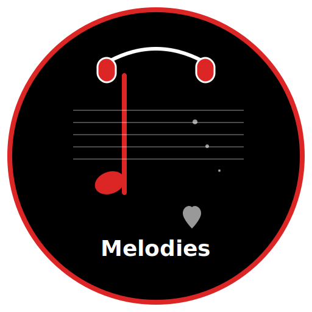

# 🎵 Melodies - Modern Music Player

<div align="center">
  
  
  **A beautiful, modern desktop music player with playlist management and local file support**
  
  [](https://opensource.org/licenses/MIT)
  [](https://electronjs.org/)
  [](https://github.com/Rajak13/Music-Player-Desktop-Icon/releases)
</div>

## ✨ Features

### 🎶 **Music Playback**
- Support for multiple audio formats: MP3, WAV, M4A, FLAC, OGG, AAC
- High-quality audio playback with volume control
- Shuffle and repeat modes (None, All, Single)
- Real-time progress tracking with seek functionality

### 📁 **Library Management**
- Easy drag-and-drop or file dialog music import
- Automatic metadata extraction from filenames
- Smart artist and title recognition
- Library statistics (song count, total duration)

### 🎵 **Playlist Features**
- Create unlimited custom playlists
- Add/remove songs from playlists
- Play entire playlists or shuffle them
- Playlist management with delete functionality

### 🎨 **Modern Design**
- Dark theme with red, black, and white color scheme
- Glass morphism design with blur effects
- Smooth animations and transitions
- Compact, always-on-top window design

### ⌨️ **Keyboard Shortcuts**
- `Space` - Play/Pause
- `←/→` - Previous/Next track
- `Ctrl+L` - Switch to Library
- `Ctrl+P` - Switch to Playlists

## 📸 Screenshots

### Player Interface
The main player screen with album art, controls, and queue preview.

### Library Management
Browse your music collection with easy upload and organization tools.

### Playlist Creation
Create and manage custom playlists for different moods and occasions.

## 🚀 Installation

### Download Pre-built Releases
1. Go to the [Releases](https://github.com/Rajak13/Music-Player-Desktop-Icon/releases) page
2. Download the appropriate installer for your platform:
   - **Windows**: `Melodies-Setup-1.0.0.exe`
   - **macOS**: `Melodies-1.0.0.dmg`

### Build from Source

#### Prerequisites
- [Node.js](https://nodejs.org/) (v16 or higher)
- [Git](https://git-scm.com/)

#### Steps
```bash
# Clone the repository
git clone https://github.com/Rajak13/Music-Player-Desktop-Icon.git
cd Music-Player-Desktop-Icon

# Install dependencies
npm install

# Run in development mode
npm start

# Build for your platform
npm run build

# Build for specific platforms
npm run build:mac    # macOS
npm run build:win    # Windows
```

## 🎵 Getting Started

1. **Launch Melodies** after installation
2. **Add Music**: Click "Add Music" in the Library tab to import your audio files
3. **Create Playlists**: Go to the Playlists tab and click "New Playlist"
4. **Enjoy**: Click any song to start playing, or use "Play All" for your entire library

## 🛠️ Development

### Project Structure
```
Music-Player-Desktop-Icon/
├── main.js              # Main Electron process
├── renderer.js          # Renderer process (UI logic)
├── index.html           # Main UI
├── assets/
│   ├── styles.css       # Application styles
│   ├── icon.svg         # App icon (SVG)
│   └── songs/           # User music files (gitignored)
├── data/
│   └── playlists.json   # Playlist data (gitignored)
└── package.json         # Project configuration
```

### Technologies Used
- **Electron** - Cross-platform desktop app framework
- **HTML5 Audio API** - Audio playback
- **CSS3** - Modern styling with custom properties
- **Node.js** - File system operations and metadata handling

## 🤝 Contributing

Contributions are welcome! Please feel free to submit a Pull Request. For major changes, please open an issue first to discuss what you would like to change.

### Development Guidelines
1. Fork the repository
2. Create a feature branch (`git checkout -b feature/AmazingFeature`)
3. Commit your changes (`git commit -m 'Add some AmazingFeature'`)
4. Push to the branch (`git push origin feature/AmazingFeature`)
5. Open a Pull Request

## 📝 License

This project is licensed under the MIT License - see the [LICENSE](LICENSE) file for details.

## 🙏 Acknowledgments

- Icons from [Font Awesome](https://fontawesome.com/)
- Fonts from [Google Fonts](https://fonts.google.com/)
- Built with [Electron](https://electronjs.org/)

## 📞 Support

If you encounter any issues or have questions:
1. Check the [Issues](https://github.com/Rajak13/Music-Player-Desktop-Icon/issues) page
2. Create a new issue if your problem isn't already reported
3. Provide detailed information about your system and the issue

---

<div align="center">
  Made with ❤️ by [Your Name]
  
  **Enjoy your music! 🎵**
</div>